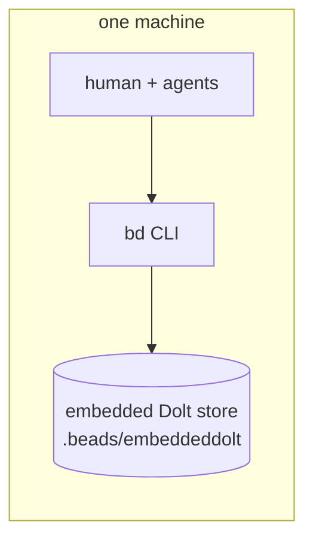
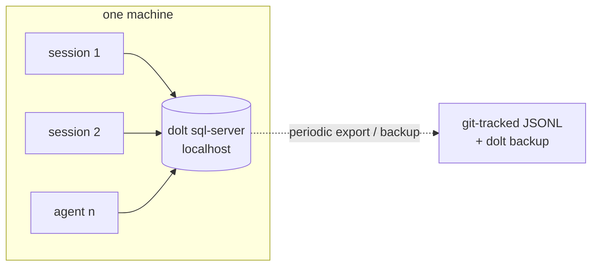
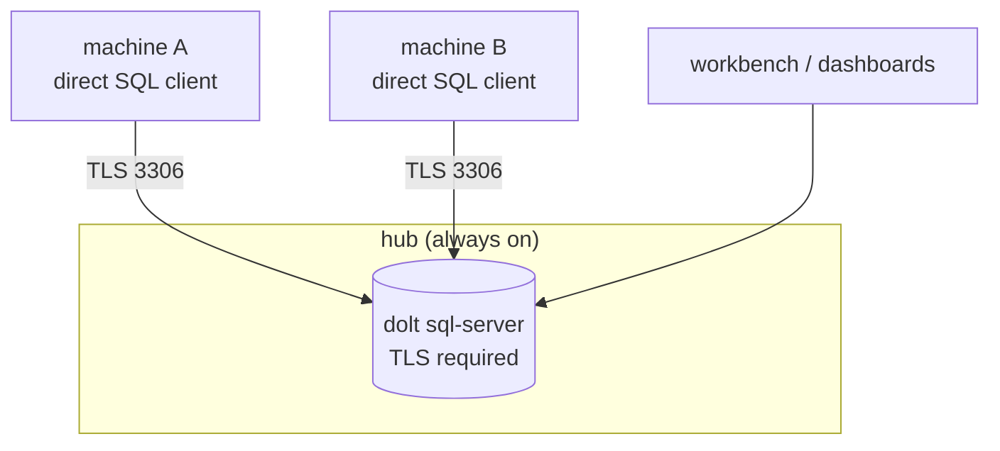
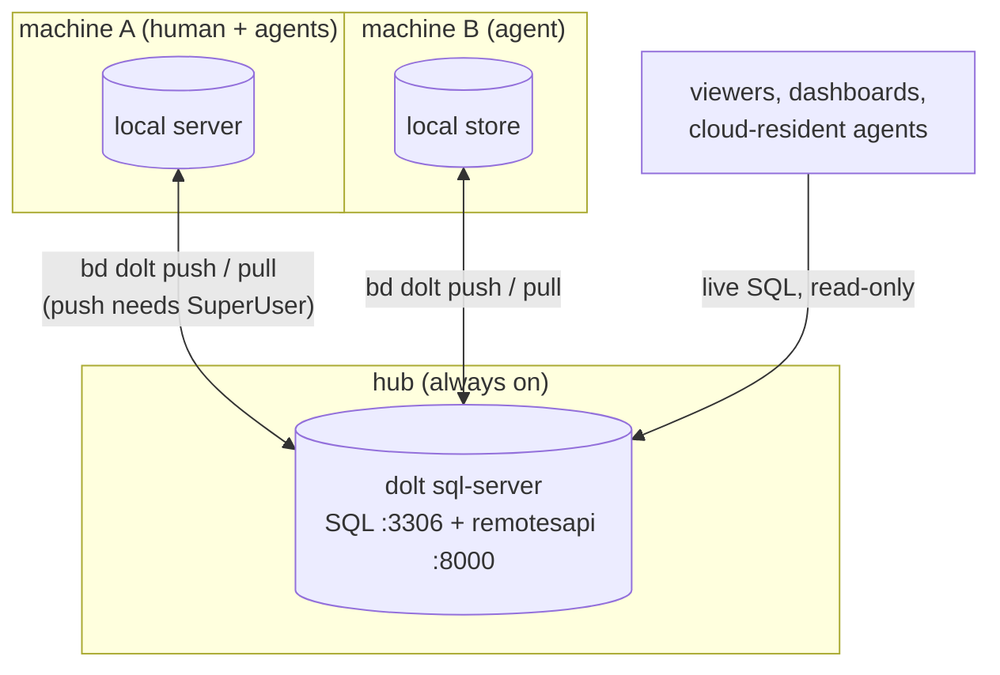
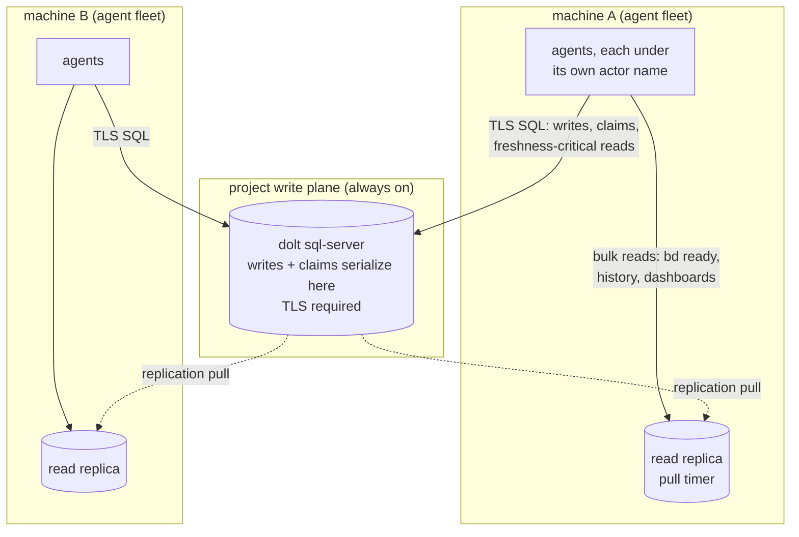
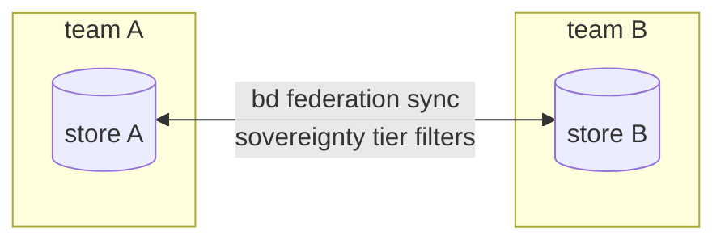
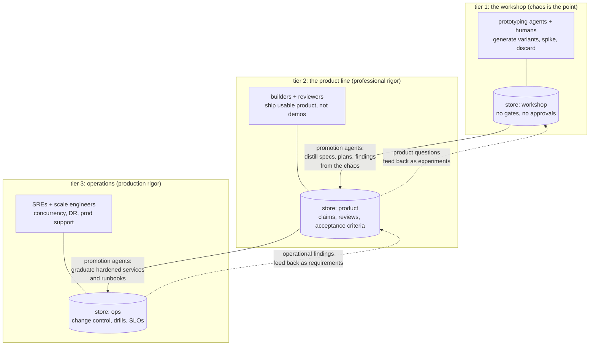

# Patterns of Use: from one laptop to a tiered team pipeline

> Status: DRAFT (2026-08-01; revised 2026-08-16). Topologies 1
> through 4 are measured on real deployments; the numbers cited come
> from an instrumented probe (orchestrator finding-106) and from a
> live staging bring-up. Topology 5 (the agent-fleet write plane) is
> design: its write plane is topology 3's deployed service unchanged,
> its derivation is recorded in _kos/findings/ findings 003 through
> 006, and its fleet-scale deployment is not yet drilled. Topology 6
> (federation) is designed upstream but gated on fixes. The capstone
> (Section 7) is a working thesis: the tier taxonomy is ours, the
> supporting practice is cited to primary sources. Direction, not
> measurement.
>
> Revision note (2026-08-16): pattern 4 now carries its validity
> domain (human-pace teams on partitionable work); pattern 5 is the
> agent-fleet default; federation and the capstone renumbered 5 to 6
> and 6 to 7.

This document maps the ways a team can run beads (bd) on Dolt, from a
single laptop to a multi-tier organization of humans and agents. Each
pattern names what it is for, what it costs, and what breaks first.
The patterns compose: most real teams run two or three at once.

A vocabulary note used throughout:

- **store**: one Dolt database holding one project's beads.
- **working copy**: a machine-local clone of a store, with its own
  full history. Writes are local; sync is explicit or automated.
- **hub**: an always-on dolt sql-server that holds the authoritative
  refs of a store and serves two surfaces at once: SQL (live queries,
  thin clients, dashboards) and remotesapi (clone, pull, push for
  working copies).
- **tier accounts**: admin, read-write, read-only SQL accounts. One
  hard fact shapes everything: pushing to a hub over remotesapi
  requires SuperUser on that hub; pulling requires only CLONE_ADMIN.
- **write plane**: a project's coordinated write authority: the hub's
  SQL surface, where writes and claims serialize. Distinct from the
  read plane (replicas, projections, dashboards), which may lag.

## 1. Solo local

One person, one machine, zero infrastructure. This is bd's default:
`bd init` creates an embedded Dolt store inside the repo. Offline
always works because there is nothing to be online to.

Costs: none. Breaks first: the moment a second machine or a second
person appears, or when the laptop dies with no remote configured.
Escape hatch: add any Dolt remote (git repo, S3, hub) and push.

## 2. Shared local server: many agents, one machine

Several concurrent sessions (a human plus 3 to 5 agents is typical)
on one machine share a single `dolt sql-server` on localhost. SQL
concurrency replaces file locking; every session sees every write
instantly.

This is the measured Phase-0 shape: launchd or systemd manages the
server, credentials live in the OS keychain, and a git-tracked JSONL
export provides the air-gap layer. Costs: one service to run. Breaks
first: the second MACHINE. A localhost pointer committed to a shared
repo sends every clone hunting for a server that is not there, and
bd's auto-start then manufactures an empty database whose failure
reads as an authentication error. Never commit host-specific
connection settings; see the kit's doctor notes.

One discipline to adopt from day one here: the SPAWNER stamps a
durable actor name (`BEADS_ACTOR`, from the person's name pool) into
every session, so concurrent sessions stay distinguishable.
Attribution is one environment variable on stock bd 1.1.2 (create
records created_by, claim writes assignee; finding-006), and every
later pattern assumes it.

## 3. Hub with thin clients

An always-on server (Kubernetes recipe in this repo, or a VM) with
every machine connecting as a direct SQL client over TLS. No local
working copies: the hub IS the store.

Everyone is always consistent because there is only one copy. Costs:
no offline writes; the hub is a single point of availability (mitigate
with the warm-standby replication in the Helm recipe). Concurrency is
the SQL server's problem, which it solves well. Choose this when the
team is always-connected and simplicity beats resilience.

## 4. Working copies with a hub (the measured distributed pattern)

Every machine runs its own local store (pattern 1 or 2) and syncs
with a shared hub by push and pull, exactly like git. This is bd's
documented cross-machine model, and the right first reach for a
distributed team working at HUMAN pace on a partitionable backlog.
It is not the fleet pattern: at machine speed its coordination
convention breaks (see the validity domain below, and pattern 5).

The hub's two surfaces work together: working copies sync through
remotesapi, while dashboards and cloud-resident agents read the same
data live over SQL. A push lands on the hub and is queryable there in
the same second.

Measured facts that shape the pattern (loopback numbers; your network
adds round trips, not new mechanics):

- push 0.32 s, pull 0.46 s for small deltas.
- Near-real-time publish is built in: `dolt.auto-push=true` plus
  `dolt.auto-commit=on` pushes after every mutating command, with a
  debounce interval. The config value must be literally `true`; the
  value `on` is accepted and silently does nothing.
- There is no auto-pull. Receive-side convergence comes from a
  session-start pull plus a periodic timer (30 to 60 seconds is
  comfortable at the measured latencies).
- Divergence behaves like git: the second pusher is rejected, pulls,
  auto-merges, pushes. Concurrent creates never collide (hash IDs).
  Concurrent comments never conflict (append-only rows).
- The sharp edge: editing the SAME bead from two machines conflicts
  almost always, even on different fields, because both writes touch
  the row's `updated_at` cell. The failure is safe (pull aborts, the
  working set is restored) but resolution currently requires a
  three-statement raw-dolt runbook; there is no bd-native resolve in
  embedded mode. See the sync-conflicts runbook in this repo.

The convention that makes conflicts rare instead of constant:

1. One active editor per bead. Claim it (assignee) before editing.
2. Cross-machine discussion goes in comments, not field edits.
3. Creates are always safe; do not serialize them.
4. When a conflict happens anyway, it is boring: run the runbook.

Validity domain (added 2026-08-16, finding-003): the convention above
is a human-pace coordination protocol standing in for an invariant
(one active editor per bead) that no replicated store grants for free
(finding-004, the CALM constraint). Autonomous agent fleets cannot
hold it: many agents touch the same beads inside every sync window,
the updated_at conflict class arrives constantly rather than weekly,
and the raw-dolt runbook becomes a standing tax. For that workload,
reach for pattern 5. For human-pace teams this remains the measured,
recommended shape.

Governance note: because remotesapi pushes require SuperUser, every
working-copy WRITER holds full SQL admin on the hub. Acceptable for a
trusted team; wrong for open enrollment. Until upstream offers a
push-scoped privilege, treat "can push" as "is an administrator" and
size your trust boundary accordingly.

Bootstrap for each new machine is two artifacts: the shareable
`sync.remote` URL in the repo's `.beads/config.yaml` (safe to commit)
and per-machine credentials delivered out-of-band (never committed).
`bd bootstrap --yes` does the rest.

## 5. Central write plane with edge read replicas: the agent fleet

> Honesty label: this pattern is design, not a drilled deployment.
> Its write plane is pattern 3's deployed, verified service unchanged;
> the new parts are the read-replica edge and the identity discipline.
> Derivation: _kos/findings/ findings 003 through 006.

The workload that forces this pattern: many autonomous agents on many
machines, all working the SAME projects at the SAME time, at machine
speed, each needing its own identity on every write. Pattern 4's
convention ("one active editor per bead, claim before editing") is a
human-pace protocol; fleets cannot hold it (finding-003).

The governing fact (finding-004): claim exclusivity is a
non-monotonic invariant, and no storage engine grants one
coordination-free. A claim IS a lock acquisition, and locks want a
lock manager. bd agrees on both counts: `bd update --claim` is atomic
against one store, and upstream's merge-slot is exactly such an
exclusive-access primitive.

The shape, in four rules:

1. **Writes and claims go to the project's write plane** (the pattern
   3 service). Any agent on any machine writes any bead as a TLS SQL
   client under its own actor name. The server serializes;
   at-most-one-claim holds by construction; the pattern-4 merge class
   does not exist here.
2. **Reads scale at the edge.** Each site that wants them runs a read
   replica (Dolt pull-on-read; stand-up in
   [runbooks/read-replica.md](runbooks/read-replica.md)) for agent
   polling, dashboards, and history tooling. Freshness-critical reads
   (is this still open, did my claim land) go to the write plane; the
   split lands exactly on the coordination seam.
3. **Identity rides every write.** The spawner stamps `BEADS_ACTOR`
   from the person's name pool ([vision.md](vision.md)); agents never
   self-report. Verified on stock bd 1.1.2 (finding-006).
4. **The replica doubles as warm DR and the offline READ story.**
   There is no offline WRITE story in this pattern; that is the price
   of enforced claims, paid deliberately. A fleet machine that loses
   the write plane keeps reading and queues its writes at the
   application layer, or waits.

Costs: the write plane is a per-project availability point (pattern
3's warm standby applies); far-flung writers pay a network round trip
per write. Breaks first: per-project write throughput, now measured
(finding-008, loopback): one instance sustains roughly 18 mutating bd
ops/s aggregate regardless of writer count, and saturation is
graceful (latency climbs, zero failures: p50 ~200ms at 4 concurrent
writers, ~1s at 16). The ceiling is the process-per-op bd CLI
(~150-200ms per invocation), not dolt, which absorbs ~3,000 rows/s in
bulk; commit policy is a no-op for one-shot invocations. Sizing rule
of thumb: at one write per agent per 30s, one instance carries ~500
agents on throughput alone; keep sustained concurrent writers per
instance in single digits for a sub-500ms p50. The same probe raced 8
claimants on one bead for 5 rounds: exactly one winner per round,
losers get a clean named error; at-most-one-claim is demonstrated,
not just designed.

Liveness (direction, tracking upstream): bd HEAD ships the lease
layer whole. A claim takes a TTL lease (default 5m, per-claim
override), `bd heartbeat` refreshes it, and `bd reclaim` is the
reaper a supervisor runs on a timer at roughly twice the TTL,
reverting dead workers' beads to ready. Leases are node-local by
design, enforceable only where granted, which is exactly this
pattern's write plane. Adopt it when it reaches a tested release and
build nothing local meanwhile (finding-007). Release caution: the
lease line shipped by accident in v1.2.1 (untested, pulled,
schema-migrating); never install that tag, and watch for its return
in a tested release.

Governance win over pattern 4: fleet writers need only the rw tier.
The SuperUser-to-push constraint belongs to remotesapi working-copy
pushes and does not apply to SQL clients; "can write" stops meaning
"is an administrator", and read-only machines stay on the ro tier.

## 6. Federation: another person, another project

Everything above is one team sharing ONE store. Federation is
different: two INDEPENDENT stores (another person's project, another
organization) exchanging beads on purpose, with sovereignty rules
about what crosses the boundary. bd ships a federation subsystem
(peers, sync strategies, sovereignty tiers, hub-spoke or mesh
topologies) that is distinct from the push/pull sync in pattern 4.

Choose federation when the other side is not you: they keep their own
authority, their own accounts, their own retention. Do not reach for
it inside one team; pattern 4 (human pace) or pattern 5 (fleets) is
simpler and stronger there. Status:
designed upstream but young; known gaps are tracked in this repo's
charter (F6), including peer-credential handling. Treat as a
direction with a working skeleton, not a drilled recipe.

## 7. Capstone: the tiered pipeline (differing levels of rigor)

The patterns above answer "how do machines share a store". This one
answers "how should a TEAM shape its work". The thesis: a team of
humans and agents produces more, faster, and safer when its pipeline
is split into tiers of deliberately different rigor, each tier with
its own store and its own rules, connected by promotion agents that
move work upward when it earns it.

Why tiers, and why separate stores:

- **Rigor is expensive, so spend it where it pays.** Review gates,
  acceptance criteria, and change control multiply the cost of every
  task they touch. Applied to prototypes they mostly destroy value:
  the prototype's job is to be cheap to make and cheap to kill.
  Applied to production they ARE the value. One store with one policy
  forces one price on both.
- **Agents change the economics of the bottom tier.** When variants
  cost less than the meeting that would have planned them, the
  correct workshop discipline is generate-and-select: make many, keep
  few, record why. A tracker in the workshop exists to remember what
  was tried and ruled out, not to gate.
- **Promotion is a job, not a ceremony.** The tier boundary is worked
  by agents whose whole role is consuming the chaos and emitting
  distilled artifacts upward: specs, plans, findings, candidate
  designs. Humans judge at the boundary (the judgment stays human;
  the paperwork does not).
- **Separate stores give each tier honest policy.** Workshop: open
  accounts, auto-push, delete freely, archive wholesale. Product:
  claims and reviews, single-active-editor, conventional gates. Ops:
  restricted writers, change windows, every bead traceable to a
  drill, an incident, or a change record. These are pattern-4 hubs
  (pattern-5 write planes where a tier's workers are autonomous
  fleets) with different account tiers and different conventions, so
  the infrastructure is the same recipe three times, tuned three ways.

### What the practice looks like at the source

Anthropic's Claude Code team describes tiered rigor as lived
practice, though never under that name. The three-store taxonomy and
its promotion agents are this document's contribution; what follows
is what the team says about their own pipeline, with sources.

**Roles are already stage-indexed.** Boris Cherny (creator of Claude
Code) proposes five archetypes on the team: "Prototyper: comes up
with brand new ideas; churns out many ideas, most of which don't
ship", "Builder: quickly turns a prototype/idea into
production-grade product/infra", "Sweeper: cleans up the UI,
simplifies the code and system, unships, optimizes performance",
plus Grower and Maintainer, and he assigns different mixes to
pre-product-market-fit, growing, and mature products [1]. That is a
staffing claim about tiers, from the primary source.

**The bottom tier exists because wrong bets are cheap.** Cat Wu
(Head of Product, Claude Code): "Because you can prototype in an
afternoon, wrong bets are cheap" [2]. The team replaced requirement
documents with prototype-first work: roughly twenty prototypes of
one feature in two days, and a three-day feature build where two
days of work were deliberately thrown away [3]. Sid Bidasaria on the
early team: "Most of what we did was prototype really quickly and
build products that showcase how strong the underlying model is. We
didn't have formal processes inside the team" [3].

**The top gate stays human where blast radius is high.** Wu, on the
record: "For the most critical changes to the core of Claude Code,
and the cores of other products, there is always a code owner and
they do manually review all the changes." For outer layers, agent
review runs without a human, a state reached through months of
per-file-path promotion based on measured catch rates, with
incident-causing PRs added to the review gate's own eval set so the
gate cannot regress [4]. A rigor gradient indexed to blast radius,
with evidence-based promotion between levels: the boundary
discipline this section proposes, described as shipped practice.

**Review is the new bottleneck, which is why gates must be priced.**
Anthropic reports that "more than 80% of the code we merge into
Anthropic's codebase was authored by Claude", that per-engineer
merged output rose several-fold, and that "speeding up one part of a
process often just shifts the bottleneck elsewhere: overall pace is
capped by the parts that haven't sped up". Their conclusion: "The
rate at which organizations can spot and fix these bottlenecks may
be a skill that improves over time, and it may become the most
important skill for any organization" [5]. Adam Wolff, from the
first agentically accelerated project: "Implementation used to be
the expensive part of the loop. With AI in the workflow, the
limiting factor is how fast you can collect and respond to
feedback" [6]. Uniform rigor spends that scarce review budget where
it buys nothing.

**Promotion fixes the process, not the artifact.** Anthropic's
large-scale migration writeup runs eight phase gates with
adversarial review rounds, discards early end-to-end runs on
purpose, validates its judges against deliberately broken code
("Validate the judge. Run it against the original code to confirm
it passes. Then run it against deliberately broken code to confirm
it fails"), assigns bigger models to reviewers than to fan-out
implementation, and promotes recurring review findings into the
rulebook rather than hand-patching files: "you don't fix the code.
You fix the process (loop) that produced the code" [7]. That is the
promotion agent's job description at the tier boundary.

Sources:

1. Boris Cherny, X, 2026-06-28.
   <https://x.com/bcherny/status/2071379474277613732>
2. Cat Wu, "Product management on the AI exponential", Anthropic
   blog, 2026-03-19.
   <https://claude.com/blog/product-management-on-the-ai-exponential>
3. Gergely Orosz, "How Claude Code is built", The Pragmatic
   Engineer, 2025-09-23 (interviews with Cherny, Bidasaria, Wu).
   <https://newsletter.pragmaticengineer.com/p/how-claude-code-is-built>
4. Cat Wu and Thariq Shihipar, AI Engineer World's Fair fireside
   chat, transcript by Simon Willison, 2026-07-21.
   <https://simonwillison.net/2026/Jul/21/cat-and-thariq/>
5. Marina Favaro and Jack Clark, "When AI builds itself", The
   Anthropic Institute, 2026-06.
   <https://www.anthropic.com/institute/recursive-self-improvement>
6. Adam Wolff, QCon San Francisco 2025, reported by InfoQ,
   2025-11-20. <https://www.infoq.com/news/2025/11/claude-ai-speed/>
7. "How Anthropic runs large-scale code migrations with Claude
   Code", Anthropic blog, 2026-07-16.
   <https://claude.com/blog/ai-code-migration>

A note on honesty: no Anthropic source proposes a named tier
taxonomy, recommends tiering to other organizations, or uses the
phrase "graduated quality gates". They describe their own practice;
the generalization is ours. Quotes above are verbatim; surrounding
characterizations are paraphrase against the cited URLs.

What the tiers are NOT:

- Not environments. Dev/stage/prod is about WHERE software runs;
  tiers are about HOW MUCH RIGOR work gets. A workshop tier has its
  own dev environment; so does ops.
- Not seniority. Senior people spike in the workshop on purpose;
  junior people run drills in ops with supervision. The tier binds to
  the work, not the person.
- Not one-way. The dotted feedback edges carry as much value as the
  promotion edges: ops findings become product requirements, product
  questions become workshop experiments.

Starting shape for a small team: run tier 1 and tier 2 only, as two
databases on one hub (pattern 4), with one promotion agent and a
weekly human pass over the boundary. Add tier 3 when something real
is in production. The recipes in this repo (kit, Helm chart, compose)
apply unchanged; only the account policy and the conventions differ
per store.

## Choosing

| You have | Reach for |
|---|---|
| One person, one machine | 1. Solo local |
| Many agents, one machine | 2. Shared local server |
| Small always-online team | 3. Hub with thin clients |
| Distributed team at human pace; offline writes matter | 4. Working copies with a hub |
| Agent fleet: many machines, same projects, machine speed | 5. Central write plane + edge read replicas |
| A second team or an external collaborator | 6. Federation |
| Enough throughput that rigor policy is a bottleneck | 7. Tiered pipeline (of pattern-4/5 hubs) |

Patterns 1 and 2 are on-ramps to 4 and 5; 3 is both a simplification
of 4 and the write plane of 5; 7 is 4 or 5 applied several times with
intent. The pace question decides between 4 and 5: humans holding a
claim convention take 4; autonomous fleets take 5, because their
claims must be enforced, not agreed.
