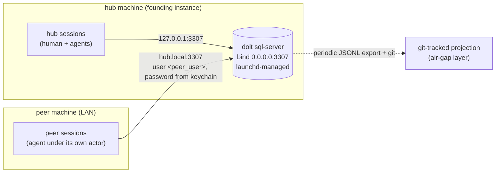
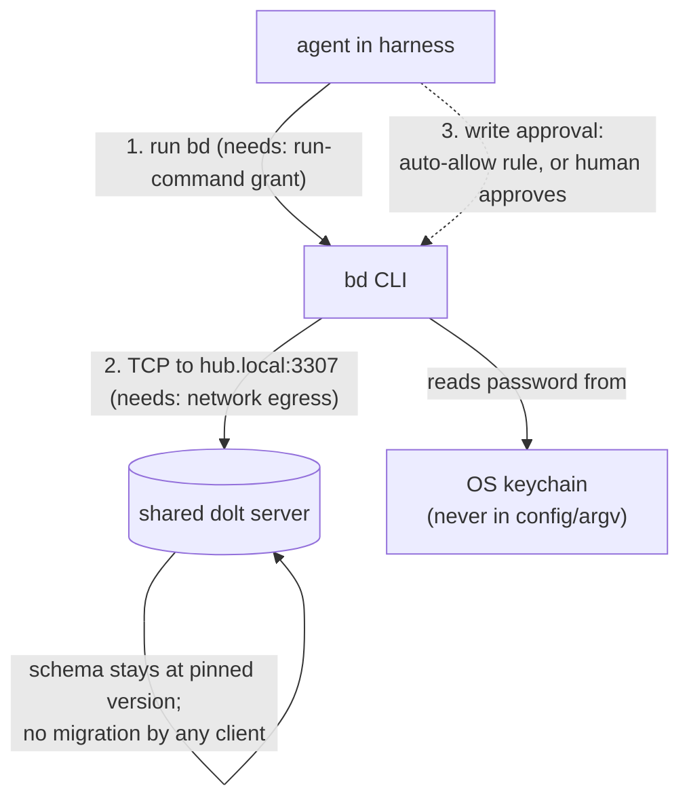

# Reference: LAN multi-writer, as actually built

> The smallest real instance of Pattern 3 (direct SQL clients to one
> shared server): two machines on one LAN, a laptop hub, a second
> machine writing live as a distinct identity, no TLS. Brought up and
> proven end to end on 2026-08-28: two independent writers, one shared
> server, correct per-writer attribution, tap-free writes, a shared
> schema neither writer can migrate by accident.
>
> This extends [local-shared-server-as-built.md](local-shared-server-as-built.md)
> (the loopback-only founding instance) by exactly one server change
> plus one peer onboarding. Read that first; this doc is the delta and
> the peer recipe. Names are generalized: `hub` is the machine running
> the server, `peer` is the second machine, `<peer_user>` is the peer's
> dolt account. Substitute your own.

## When to reach for this

You already run the shared local server (Pattern 2) and a SECOND
machine on the same trusted network needs to write to the same board,
now, with low latency and its own identity. This is Pattern 3 at
two-machine scale on a laptop hub. It buys immediate shared writing
without standing up cloud infrastructure.

What it does NOT give you, inherited from Pattern 3: no offline writes
(the hub is the store), a single availability point (the laptop), and
in this variant no transport encryption. It is correct on a trusted
LAN with a password gate; it is wrong across an untrusted network or
for open enrollment. When those constraints bite, graduate to the
cloud hub (the k8s recipe) or the working-copy model (Pattern 4).

### Wireline exposure: what a plaintext listener does and does not leak

Be precise about the no-TLS trade-off, because the two halves have very
different severity:

- **The credential is well protected even without TLS.** dolt's default
  auth plugin is `mysql_native_password`, a challenge-response scheme:
  the cleartext password never crosses the wire, the per-connection
  scramble blocks replay, and a strong random password (24 bytes here)
  defeats offline cracking of a captured handshake. Do NOT switch to
  `caching_sha2_password` on a plaintext listener: its full-auth path
  can fall back to sending the password, which native_password never
  does. Keep the password long and random.
- **The session data is exposed.** Without TLS, every query and every
  row of result data (bead titles, descriptions, comments) travels in
  cleartext and is sniffable by any host with visibility onto the LAN
  segment. This, not the password, is the real wireline risk.

The fix is native and cheap: dolt sql-server supports TLS
(`listener.tls_cert`, `listener.tls_key`, `listener.require_secure_transport`,
and `listener.require_client_cert` for mTLS). Generate a server cert and
key, point the listener at them, require secure transport, and have
peers connect over TLS. Enable it before this variant carries anything
sensitive or touches any network you do not fully trust. Until then,
treat the board's contents as visible to the LAN.

## Topology



The one and only server change from the loopback as-built: the listener
binds all interfaces instead of loopback. Everything else (launchd,
keychain auth, per-project databases, JSONL archival) is unchanged. The
hub's own sessions keep using `127.0.0.1`; `0.0.0.0` covers loopback, so
nothing on the hub side changes.

## Part A: enable the network on the hub

### A1. Bind the listener to all interfaces

Edit the server's `config.yaml` (`~/.beads/shared-server/config.yaml`):

```yaml
listener:
  host: 0.0.0.0        # was 127.0.0.1; 0.0.0.0 still covers loopback,
                       # so the hub's own bd (127.0.0.1) is unaffected
  port: 3307
  max_connections: 100
```

Back the file up first (`cp config.yaml config.yaml.bak-<date>`), so the
revert is one copy. Restart the launchd job to apply (config is read at
start):

```sh
launchctl kickstart -k gui/$(id -u)/com.<org>.beads-dolt-server
```

Verify the bind flipped and the hub's own bd still works:

```sh
lsof -nP -iTCP:3307 -sTCP:LISTEN     # expect *:3307 (was 127.0.0.1:3307)
bd count                            # hub-side bd over loopback, unchanged
```

### A2. Reachability and the firewall

On macOS the application firewall, if enabled in block mode, will stop
inbound connections to the server process. Check and decide:

```sh
/usr/libexec/ApplicationFirewall/socketfilterfw --getglobalstate
```

If it is off, the port is immediately LAN-reachable (auth is the only
gate). If it is on, either allow the `dolt` binary or, better, scope
`3307` to the LAN with a packet-filter rule. Leaving `3307` open to the
whole LAN with only a password gate is acceptable on a trusted network;
tightening the grant host (A4) and adding a firewall scope are the
hardening steps before you widen the blast radius.

### A3. Host discovery: use mDNS, not an IP

Give the peer a name that survives DHCP changes. macOS advertises
`<hostname>.local` over mDNS (Bonjour); Linux does the same with Avahi.
The peer points at `hub.local`, and the connection string never changes
even if the hub's lease does. Keep the raw LAN IP only as a documented
fallback for networks where mDNS is filtered.

```sh
# from the peer, test both:
nc -z -G 3 hub.local 3307 && echo "hub.local OPEN"
nc -z -G 3 <HUB_LAN_IP> 3307 && echo "IP OPEN"
```

### A4. Mint the peer's identity (a dolt SQL user)

Auth and attribution are two layers. This is the auth layer: a dolt user
the peer authenticates as. (Attribution, `BEADS_ACTOR`, is separate, C4.)

Run admin SQL against the running server. `dolt sql` executed from inside
the server's data dir proxies to the live server as a local superuser, so
no password is needed for admin:

```sh
cd ~/.beads/shared-server
PW=$(openssl rand -hex 24)          # generate in-shell; never type a secret literally
dolt sql -q "
  CREATE USER IF NOT EXISTS '<peer_user>'@'%' IDENTIFIED BY '${PW}';
  GRANT ALL PRIVILEGES ON \`<project_db>\`.*  TO '<peer_user>'@'%';
  GRANT ALL PRIVILEGES ON \`beads_global\`.*  TO '<peer_user>'@'%';
  FLUSH PRIVILEGES;"
echo "deliver out of band: ${PW}"
```

Notes that matter:

- **No global SUPER for the peer.** The hub's own user needs SUPER for
  bd's auto-backup; the peer does not, because bd auto-skips backup for a
  non-localhost server (it detects the client filesystem differs). Grant
  the peer only its two databases.
- **`@'%'` vs subnet.** `@'%'` accepts the peer from any source address,
  which is simplest for a first connection. Tightening to the LAN subnet
  (`'<peer_user>'@'192.168.x.%'`) is the defense-in-depth step; do it
  once you know the peer's source subnet so you are not debugging a host
  mismatch during bring-up.
- **`GRANT ALL` on a database includes `EXECUTE`**, which the peer needs
  for dolt's stored procedures (`dolt_commit`, etc.) in the DB context.

### A5. Credential custody

- Server side: the dolt privilege database (`.doltcfg/privileges.db`)
  holds password hashes and is `0600`. Keep the whole server tree `0700`
  (`chmod 700 ~/.beads/shared-server ~/.beads/shared-server/.doltcfg`);
  the same-uid server keeps working.
- Delivery: hand the generated password to the peer's operator OUT OF
  BAND. Never put it in a git commit, an issue, or a chat log. If it
  leaks, rotate with `ALTER USER '<peer_user>'@'%' IDENTIFIED BY '<new>'`.
- The hub never stores the peer's password after minting it; it lives in
  the peer's keychain (C3).

## Part B: version pinning (the load-bearing constraint)

The real hazard is bd itself, not the network. bd auto-migrates the
shared schema on connect when its binary is newer than the schema on
disk. A single connection from a too-new bd rewrites the schema for
everyone and strands every writer still on the old binary.

The rule for the whole deployment:

- **Every writer runs the same bd version, pinned.** The founding
  instance runs bd on a schema at a known version (record it: run
  `bd sql "SELECT MAX(version) FROM schema_migrations"` on the hub and
  write the number into your runbook). Every peer must match it.
- **Pin and never upgrade while pointed at the shared server.** On
  Homebrew: `brew pin beads` (and `brew pin dolt` if present). Never
  `brew upgrade beads`.
- **Refuse the known-bad tag.** bd v1.2.1 shipped a schema migration by
  accident (it moves the schema forward and was pulled); never install
  it. Confirm the pinned version is the intended one before first
  connect.
- **Kill stale shadows.** A second `bd` on `PATH` (for example an old
  `~/go/bin/bd` from a source install) can silently be the one that runs.
  Delete it or fix `PATH` so `command -v bd` resolves unambiguously to
  the pinned binary.

### The parity gate (peer runs this BEFORE its first write)

```sh
bd sql "SELECT MAX(version) AS schema_version FROM schema_migrations;"
# MUST equal the hub's recorded schema version.
```

If it does not match, or if bd prints any "migrating" / "applying
migration" line on connect, STOP. Do not write. There is no server-side
guard that refuses a migrating client; this discipline is the only
protection today.

The peer must also never run a local server or `bd init` against the
shared database, and never run `bd backup` against the hub.

## Part C: onboard the peer (second machine)

macOS peer shown; the Linux deltas are called out inline.

### C1. Install the pinned tools

```sh
brew install beads
bd version                 # MUST be the pinned version; if not, install the exact
                           # release from the beads GitHub releases page
brew pin beads
# dolt is NOT required for a client-only peer (bd talks the MySQL wire
# protocol directly). If present, pin it and do not run a server.
```

### C2. Get the database pointer (clone the repo)

bd reads which database to use from the repo's git-tracked
`.beads/metadata.json`. Clone the project repo so the peer has it; the
peer's environment (C3) overrides the host/user/password fields in that
file. Do not edit or commit `.beads/metadata.json`, and do not run
`bd init`.

Then harden and set the role (both local-only, neither touches the hub):

```sh
chmod 700 .beads
git config beads.role maintainer
```

### C3. Client environment

The credential lives in the OS keychain, never in a file. Create
`~/.beads/<peer>-client-env.sh`:

```sh
#!/bin/bash
export BEADS_DOLT_AUTO_START=false          # never auto-start a local server
export BEADS_DOLT_SERVER_HOST=hub.local     # fallback: <HUB_LAN_IP>
export BEADS_DOLT_SERVER_PORT=3307
export BEADS_DOLT_SERVER_USER=<peer_user>
if BEADS_DOLT_PASSWORD=$(security find-generic-password -s beads-dolt-<peer> -a <peer_user> -w 2>/dev/null); then
    export BEADS_DOLT_PASSWORD
else
    unset BEADS_DOLT_PASSWORD               # fail to a clean auth error, not an empty export
fi
export BEADS_ACTOR="<peer_user>/$(hostname -s)/$(tty 2>/dev/null | sed 's#^/dev/##; s#/#-#g' || echo notty-$$)"
```

Store the password (delivered out of band) in the keychain once:

```sh
security add-generic-password -s beads-dolt-<peer> -a <peer_user> -w 'THE_PASSWORD' -U
# Linux analogue: secret-tool store --label='beads <peer>' service beads-dolt-<peer> account <peer_user>
# and in the env script: secret-tool lookup service beads-dolt-<peer> account <peer_user>
```

Source it from the shell rc:

```sh
# ~/.zshrc
[ -f ~/.beads/<peer>-client-env.sh ] && source ~/.beads/<peer>-client-env.sh
```

The env vars are load-bearing: they override the loopback host/user in
the tracked `metadata.json`, so a second machine joins WITHOUT untracking
or templating that file. `BEADS_DOLT_AUTO_START=false` plus the explicit
host and port stop bd from path-hashing a per-project port and
auto-starting an empty local server to fail against.

### C4. Identity and role

Two distinct things, both must be right:

- **`BEADS_DOLT_SERVER_USER`** (C3) is the SQL account: authentication
  and access. It is `<peer_user>`, minted in A4.
- **`BEADS_ACTOR`** (C3) is attribution: what every bead the peer writes
  is stamped with (`created_by`, and `assignee` on claim). Derive it per
  machine so writers stay distinguishable on the board.
- **`beads.role maintainer`** (C2) is bd's write-routing role. A peer
  that writes DIRECTLY to the shared server (no dolt remote, no submit
  flow) is a `maintainer`, the same as the hub's own checkout.
  `contributor` is wrong here: it expects a maintainer REMOTE to route
  submissions to, which this topology does not have, so it misroutes or
  warns. (If you later move to the working-copy + hub model, the role
  picture changes there; this is the correct value for direct-write
  peers.)

### C5. Verify (read-only), then the round-trip

```sh
bd count                 # the shared board's count; matches the hub
bd sql "SELECT MAX(version) FROM schema_migrations;"   # the parity gate; must match
```

Then prove both directions with a marked, disposable bead each: the peer
creates one, the hub confirms it sees it with the peer's owner string,
and the reverse. Check the owner strings: the peer's bead reads
`Owner: <peer_user>/<peer-host>/...`, the hub's reads the hub actor. That
distinct attribution across the LAN is the proof the deployment works.

## Part D: harness permissions

An agent harness needs three grants to drive bd against the shared
server, plus one custody rule. The first row is measured on this
bring-up; the rest are speculation from each tool's documented model and
are labelled as such. Verify against your installed version.

| Harness | Run `bd` | Reach `hub.local:3307` | Let writes proceed | Config home |
|---|---|---|---|---|
| **Claude Code** (measured) | allow `Bash(bd:*)` (or a wrapper) in `settings.json` | outbound TCP not sandboxed by default; works as-is | reads auto-allow; `bd create`/`update`/`close` are gated by the auto-approval classifier and need either operator approval or explicit allow rules (`Bash(bd create:*)`, etc.) | `.claude/settings.json` |
| **Codex CLI** (speculation) | `bd` runs under the shell tool | the `workspace-write` sandbox blocks network by default; enable it (`[sandbox_workspace_write] network_access = true`, or a broader sandbox) or the connect fails | approval policy (`--ask-for-approval` / `approval_policy`); set so `bd` mutations do not prompt per-write once trusted | `~/.codex/config.toml` |
| **Crush** (speculation) | allow the shell/bash tool to run `bd ...` in the permission allowlist | allow outbound to the hub if the tool restricts network | per-tool permission / allowed-commands entry for `bd` writes | project/user Crush config |
| **opencode** (speculation) | `permission.bash` map entry `"bd *": "allow"` (with `ask`/`deny` for the rest) | allow egress to the hub if sandboxed | the same bash-permission map governs writes; set the mutations to `allow` or `ask` | `opencode.json` |

The custody rule is the same for every harness and is not speculation:
**the password stays in the OS keychain, sourced by the client env; it
never goes in harness config, argv, or a prompt.** On this bring-up a bd
command that carried the password inline on the command line was blocked
by the classifier as a credential-on-argv; keep secrets out of argv.

The common shape, harness-independent:



## Rollback

The whole network extension reverts cleanly, and the hub's own bd is
never affected:

```sh
cp ~/.beads/shared-server/config.yaml.bak-<date> ~/.beads/shared-server/config.yaml
launchctl kickstart -k gui/$(id -u)/com.<org>.beads-dolt-server   # back to loopback
cd ~/.beads/shared-server && dolt sql -q "DROP USER '<peer_user>'@'%';"
```

## Cross-references

- The topology this instantiates: [patterns.md](../patterns.md) Pattern 3.
- The loopback foundation this extends:
  [local-shared-server-as-built.md](local-shared-server-as-built.md).
- The bootstrap gotchas shared with the loopback build are enumerated
  there (env vars load-bearing, `--external` not persisted, `bd init`
  probes the git remote, `beads_global` pre-create, auto-backup SUPER,
  hooks run non-interactive).
